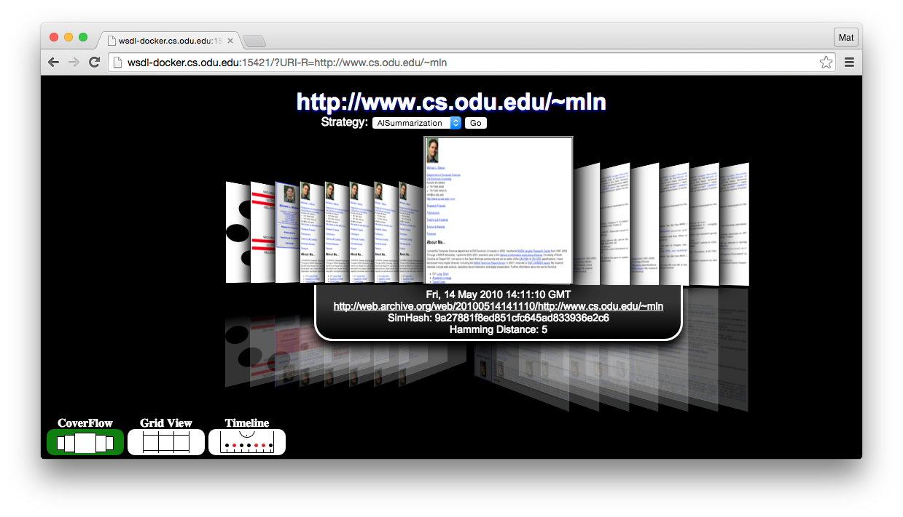

<<<<<<< HEAD
ArchiveThumbnails
================

An implementation of Ahmed AlSum's 2014 ECIR paper titled ["Thumbnail Summarization Techniques for Web
Archives"](http://www.cs.odu.edu/~mln/pubs/ecir-2014/ecir-2014.pdf) for the Web Archiving Incentive Program for Columbia University Libraries' grant, "Visualizing Digital Collections of Web Archives".



## Requirements

[Node.js](https://nodejs.org/) is required to run the service. Once Node is installed, the packages required to use the service can be installed by running `npm install -g` in the root of the project directory. [PhantomJS](http://phantomjs.org/) may also additionally be required depending on your system configuration.

## Running

To execute the code, run `node AlSummarization.js`.

To query the server instance generated using your browser visit `http://localhost:15421/?URI-R=http://matkelly.com`, substituting the URI-R to request a different site's summarization. The additional parameters of `access` and `strategy` can be used to change the summarization process, specifying the means of access and the strategy used for summarization (respectively). `access` can be one of `interface`, `embed`, or `wayback`. `strategy` can be `alSummarization`, `random`, `interval`, or `temporalInterval`.

### Example URIs

* `http://localhost:15421/?URI-R=http://matkelly.com`
* `http://localhost:15421/?access=embed&URI-R=http://matkelly.com`
* `http://localhost:15421/?strategy=random&URI-R=http://matkelly.com`
* `http://localhost:15421/?access=wayback&strategy=yearly&URI-R=http://matkelly.com`
* `http://localhost:15421/http://matkelly.com`

## Running as a Docker Container (experimental)

Running the server in a [Docker](https://www.docker.com/) container can make the process of dependency management easier. The code is shipped with a `Dockerfile` to build a Docker image that will run the service when started. This document assumes that you have Docker setup already, if not then follow the [official guide](https://docs.docker.com/installation/).

### Building Docker Image

Clone the repository and change working directory (if not already) then build the image.

```
$ git clone https://github.com/machawk1/ArchiveThumbnails.git
$ cd ArchiveThumbnails
$ docker build -t archthumb .
```

In the above command `archthumb` is the name of the image which can be anything, but the same needs to be used when running the container instance.

### Running Docker Container

```
$ docker run -d -p 15421:15421 -p 1338:1338 -p 15422:15422 alsummarization
```

In the above command the container is running in detached mode and can be accessed from outside on port `15421`. If you want to run the service on a different port, say `80` then change `-p 15421:15421` to `-p 80:15421`.

Container is completely transparent from the outside and it will be accessed as if the service is running in the host machine itself.

### Running via Docker Compose

An alternate way of running the service container is using [Docker Compose](https://docs.docker.com/compose/). We have provided a default `docker-compose.yml` file to build and run the container easily. Provided that the Docker daemon is running and the Docker Compose binary is installed, running following command from the directory where this repository is checked out will build an image if necessary and spin a container.

```
$ docker-compose up -d
```

The `docker-compose.yml` file has port mapping as described in the previous section. Additionally it also makes the generated thumbnail persistent on the host machine in the `thumbnails` directory under this checked out code directory. Please feel free to modify or inherit from the `docker-compose.yml` file according to your needs.
=======
# TimemapVisualization
>>>>>>> 280830f6acd8114c267c730d77d8387c787ff82e
